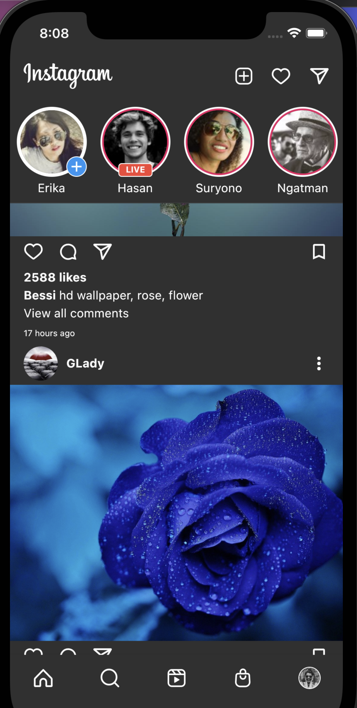
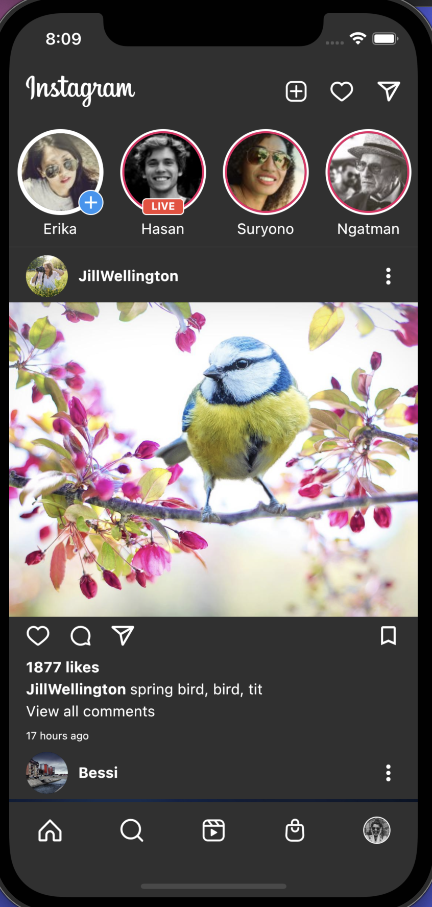

# Flutter Instagram UI with Rest API

Layouting the UI for Instagram and creating the Rest API

## Youtube Link

https://youtu.be/Gz_VvDrTnfw

## API

- GET with pixabay.com

## ScreenShot

| Home         | Home           |
|--------------|----------------|
|  |       |

